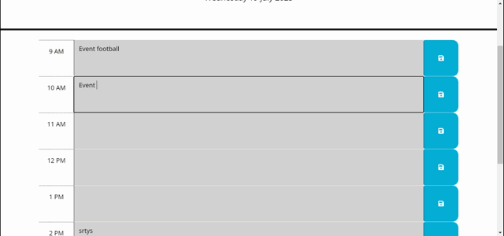

# Day Planner - 5 Day planner 9am to 5pm

## Contents
* [Project Description](#description)
* [Technologies Applied](#technologies-used)
* [Initial Usage](#initial-usage)
* [Application Demonstration](#application-demonstration)
* [Project Deployment](#references)

## Project Description

This project consists of a simple daily planner with 9 am - 5 pm slots.
The purpose of this project with the starter code provided was to complete writing the code including application in JavaScript to allow for functionality.
The user can write down in the slots and planned events which can be stored in local storage with a button click.

## Technologies Applied

The project from the initial stages had HTML code, CSS code, and JS code.
For the time of day and Date Day.js was included and the calendar events are stored in the local storage.

## Initial Usage

When the user opens up the app, the user will see a display day planner with eight slots for the time of day.
Past time is greyed out
The present background color is green
The future background is red
After the user types the event in the planner and clicks the save button JS saves the text with time as a key-value pair in the local storage.
The Events are priority is color based as in the past present and future.

## Application Demo

## Project Deployment link

https://tocopro.github.io/Calendar_Application/

## Project Repository

https://github.com/Tocopro/Calendar_Application
